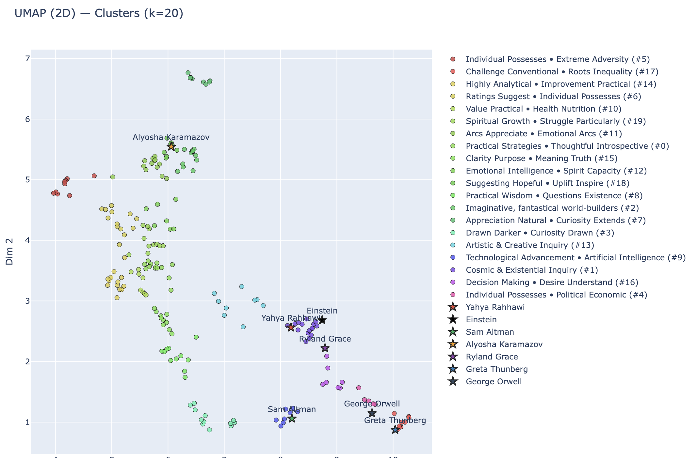
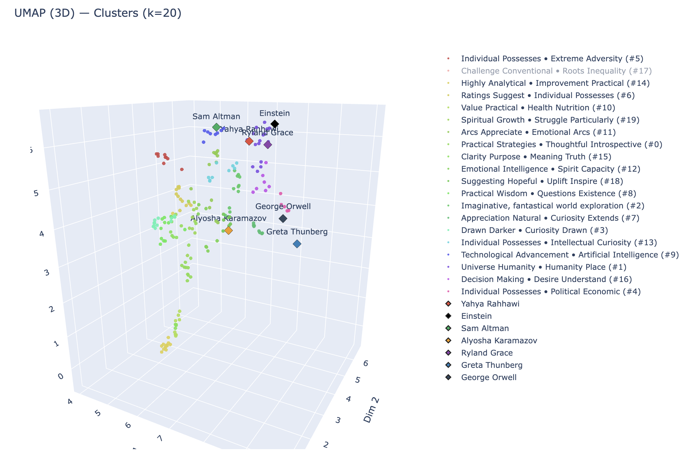

## Mello-ML — Unified Personality Profiling and Embeddings

An end‑to‑end system I built to explore personality‑aware matching and through culture and behavior. It turns rich, natural‑language inputs (books, films, music, self‑descriptions, and Big Five behaviors) into structured profiles and high‑dimensional meaningful embedding space for similarity, clustering, and visualization.

### Why I built this

- Combine qualitative signals (reviews, reflections, vibe) with quantitative Big Five behaviors to infer a cohesive personality profile.
- Represent people as vectors that capture both interests and how they think/behave, not just what they consume.
- Visualize communities and nearest neighbors in an interpretable way (PCA/UMAP) while keeping the pipeline modular and testable.
- Study Graph patterns in social connections at a college campus, such as friendship chain lengths and cliques.

### Architecture at a glance

- Data contract from the web app (sibling prototype in `../Mello-prototype/`) provides profile, books/movies/music, Big Five selections, and short prompts.
- `profile_generator.py` synthesizes:
  - A unified, 200‑word personality narrative from cultural signals.
  - Trait‑level descriptions for Openness, Conscientiousness, Extraversion, Agreeableness, Neuroticism.
- `embedding_generator.py` converts the unified paragraph and each trait into 768‑dimensional vectors (Gemini embeddings). Final user vector: 4608D (1×768 + 5×768).
- `population.py` stores many users, supports similarity search and JSON import/export.
- `visualizer.py` produces interactive PCA/UMAP plots (Plotly) and similarity views.

### Technical highlights

- Robust external calls: backoff, jitter, and rate‑limit handling for both LLM and embedding services.
- Resilient JSON parsing from LLM output (code‑block stripping, partial extraction).
- Deterministic vector layout: fixed ordering of components enables trait‑specific search (e.g., “closest by Agreeableness”).
- Similarity via normalized Euclidean distance mapped to [0,1], avoiding instability from raw magnitudes.
- Interactive analytics: PCA for variance‑based projections; UMAP for local neighborhood structure when sample size ≥10.
- Synthetic generation: 50 personality archetypes to stress‑test diversity and edge cases.

### Results and artifacts

- End‑to‑end test creates a mixed population (real JSON + synthetic), generates profiles/embeddings, and saves population snapshots.
- Visualizations highlight clusters and nearest neighbors; “special” users can be emphasized to evaluate model behavior.

UMAP of the personality space with labeled clusters:

3D UMAP clusters:

### Selected engineering decisions

- Chose 768D per component for a balance of expressiveness and cost; concatenation favors interpretability over learned fusion at this stage.
- Kept similarity metric simple and transparent; future work can experiment with supervised metric learning.
- Separated concerns cleanly across `User`, `Population`, generators, and visualization to keep the pipeline testable and swappable.

### Future directions

- Grounding: add retrieval over public cultural corpora to enrich sparse inputs.
- Learning to rank: fine‑tune a projection head using human feedback on “good match” judgments.
- Bias/robustness: audits for demographic leakage, introspective stress tests, prompt‑level guardrails.

### Stack and services

- Python, NumPy, Plotly, scikit‑learn, UMAP‑learn
- LLM via OpenRouter (profile synthesis); vector embeddings via Gemini
- `.env`‑based configuration, lightweight logging, optional Faker for synthetic users

---
Built to be readable, modular, and easy to extend for research and product experiments.

